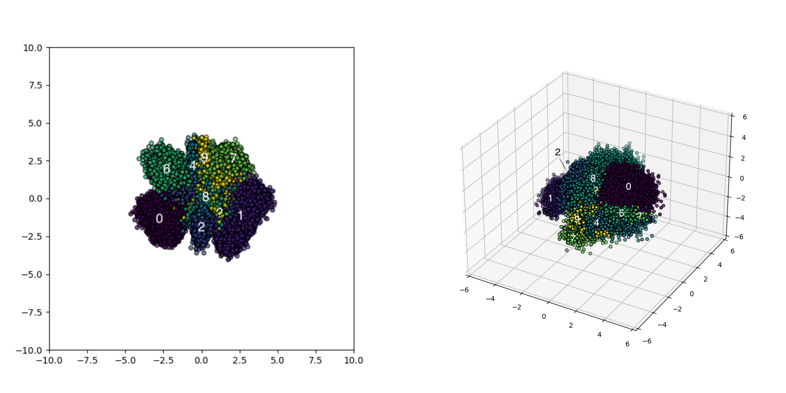

# Recognition and Interpretation in Dysfunctional Image Generation

The research project is designed to focus on a few potential topics of dysfunctional issues such as "latent feature loss", "unbalancing data generation", and "vanishing divergence". This project explores the marginal fields of image generation techniques and provides insights into further advancement of the existing deep generative processes.

## Team Members

| Team Member   | Contact             |
|---------------|---------------------|
| Eden Zhou     | zhou9@ualberta.ca   |
| Rui Guo       | rg5@ualberta.ca     |

## Table of Contents

* [Prerequisites](#Prerequisites)
* [Requirements](#Requirements)
* [Directory Structure](#Structure)
* [Installation](#Installation)
* [Usage](#Usage)
* [Outcome](#Outcome)

## Prerequisites
### Environment
- Python (3.8+)
- Pytorch
- CUDA
- numpy
- Sklearn

### Dependencies
Before you begin, ensure you have met the following requirements:

```txt
torch~=2.0.1
numpy~=1.26.2
scipy~=1.10.1
matplotlib~=3.6.3
scikit-learn~=1.2.1
torchvision~=0.15.2
Pillow~=9.3.0
```

To install requirements:

```python
pip install -r requirements.txt
```

## Structure

```
├─ vae.py  -->  VAE Builder;
├─ vae2D.py  -->  2D VAE Processor;
├─ vae3D.py  -->  3D VAE Processor;
├─ vae_2d.pth  -->  Pre-trained 2D VAE Model;
├─ vae_3d.pth  -->  Pre-trained 3D VAE Model;
├─ calFID.py  -->  FID calculator;
├─ classify.py  -->  kNN classifier;
```

## Installation


To install the project, follow these steps:

Linux and MacOS:
```
pip install unzip
unzip project.zip
```

Windows:
```
tar -xzvf project.zip
```
Or you can unzip the `ZIP` file directly through the interface.


## Execution
### Main Programs
To process `2D VAE`, you could execute

```python
python3 vae2D.py
```

If you don't have the pre-trained model, you need to train the model by yourself. You can execute `vae.py` and follow the corresponding instruction to train a 2D VAE model.


- You can follow the instruction to have different visualization and modelling of the 2D latent space 
  - `MODE 01: Continue Training`: 
    - take 100 more epochs (by default) training on the input pre-trained model;
  - `MODE 02: Tests`: 
    - Take one epoch test to check the loss (generation loss + KLD) between the generation set and the original set;
  - `MODE 03: Visualization & Sampling`:
    - Follow the instruction and type "yes" or "y" to response to the different requests;
      - `GMM` and/or `kNN` Modelling of the latent space in 2D VAE;
      - Visualization of the latent space with training data mapping;
      - `marginal` and/or `central` data points sample from the latent space in 2D VAE;


To process `3D VAE`, you could execute

```
python3 vae3D.py
```

- You can follow the instruction to have different visualization and modelling of the 3D latent space 
  - `MODE 01: Continue Training`: 
    - take 100 more epochs (by default) training on the input pre-trained model;
  - `MODE 02: Tests`: 
    - Take one epoch test to check the loss (generation loss + KLD) between the generation set and the original set;
  - `MODE 03: Visualization & Sampling`:
    - Follow the instruction and type "yes" or "y" to response to the different requests;
    - `GMM` and/or `kNN` Modelling of the latent space in 3D VAE;
    - Visualization of the latent space with training data mapping;
    - (Optional, may lead to potential errors) `marginal` and/or `central` data points sample from the latent space in 3D VAE;

### Helper Programs
To build a new VAE model, you could use `VAE Builder` such as

```python
python3 vae.py
```
- You can follow the instruction to decide the dimension of model you would like to train (for 100 epochs by default);
- You may need to select the model dimension such as
  - `MODE 02: Build 2D VAE`:
    - Follow the instruction and type "yes" or "y" to response;
    - The model generated will be stored in the same directory name `vae_2d.pth`;
    - *WARNING: The measure may replace the existing pre-trained model with the same name;
  - `MODE 03: Build 3D VAE`: 
    - Follow the instruction and type "yes" or "y" to response;
    - The model generated will be stored in the same directory name `vae_3d.pth`;
    - *WARNING: The measure may replace the existing pre-trained model with the same name;


To classify images, you could use `kNN Classifier` such as

```python
python3 classify.py
```
- You can follow the instruction to enter the directory path of the images you generated;
- The kNN model will use the original MNIST dataset to process the prediction;

To compute FID scores, you could use `FID Calculator` such as

```python
python3 calFID.py
```
- You may need to manually enter two image directory paths to the codes to process the computation;
- The FID score will be reported and printed to the command line


## Outcomes

> *Please refer to the relevant paper report for more details;

### Clusters in the latent space of 2D VAE and 3D VAE



### IS and FID of the generated sets from 2D VAE and 3D VAE

| Generated Image Sets           | IS     | FID     |
| ------------------------------ | ------ | ------- |
| VAE(2D) - Marginal Generations | 11.284 | 220.916 |
| VAE(3D) - Marginal Generations | 20.884 | 188.870 |
| VAE(2D) - General Generations  | 5.646  | 112.903 |
| VAE(3D) - General Generations  | 6.321  | 107.746 |

### Distribution of digit types in 2D VAE and 3D VAE

| Types of Digits            | 0      | 1      | 2     | 3      | 4      | 5     | 6      | 7      | 8     | 9     | Sum   | Avg  |
| -------------------------- | ------ | ------ | ----- | ------ | ------ | ----- | ------ | ------ | ----- | ----- | ----- | ---- |
| Training Set(#)            | 5923   | 6742   | 5958  | 6131   | 5842   | 5421  | 5918   | 6265   | 5851  | 5949  | 60000 | 6000 |
| VAE(2D) - Generated Set(#) | 4428   | 3786   | 2576  | 6652   | 4175   | 354   | 3591   | 2008   | 566   | 1864  | 30000 | 3000 |
| VAE(3D) - Generated Set(#) | 2948   | 6823   | 1476  | 4253   | 4751   | 2425  | 2089   | 2681   | 1750  | 814   | 30000 | 3000 |
| Training Set(%)            | 9.87%  | 11.24% | 9.93% | 10.22% | 9.74%  | 9.03% | 9.86%  | 10.44% | 9.75% | 9.92% | 100%  | 10%  |
| VAE(2D) - Generated Set(%) | 14.76% | 12.62% | 8.59% | 22.17% | 13.92% | 1.19% | 11.97% | 6.69%  | 1.89% | 6.20% | 100%  | 10%  |
| VAE(3D) - Generated Set(%) | 9.79%  | 22.74% | 4.92% | 14.18% | 15.84% | 8.08% | 6.96%  | 8.94%  | 5.84% | 2.71% | 100%  | 10%  |

### FID of different digits in the generated set of 2D VAE and 3D VAE

| Type of Digits          | 0        | 1        | 2        | 3        | 4        | 5        | 6        | 7        | 8        | 9        |
| ----------------------- | -------- | -------- | -------- | -------- | -------- | -------- | -------- | -------- | -------- | -------- |
| VAE(2D) - Generated Set | 207.4569 | 171.6291 | 210.5091 | 197.6481 | 191.3871 | 228.2051 | 251.1663 | 258.4876 | 218.7353 | 231.7673 |
| VAE(3D) - Generated Set | 239.6646 | 127.0432 | 175.0209 | 171.9411 | 134.1443 | 189.7628 | 201.1065 | 142.4139 | 165.2396 | 141.6462 |


